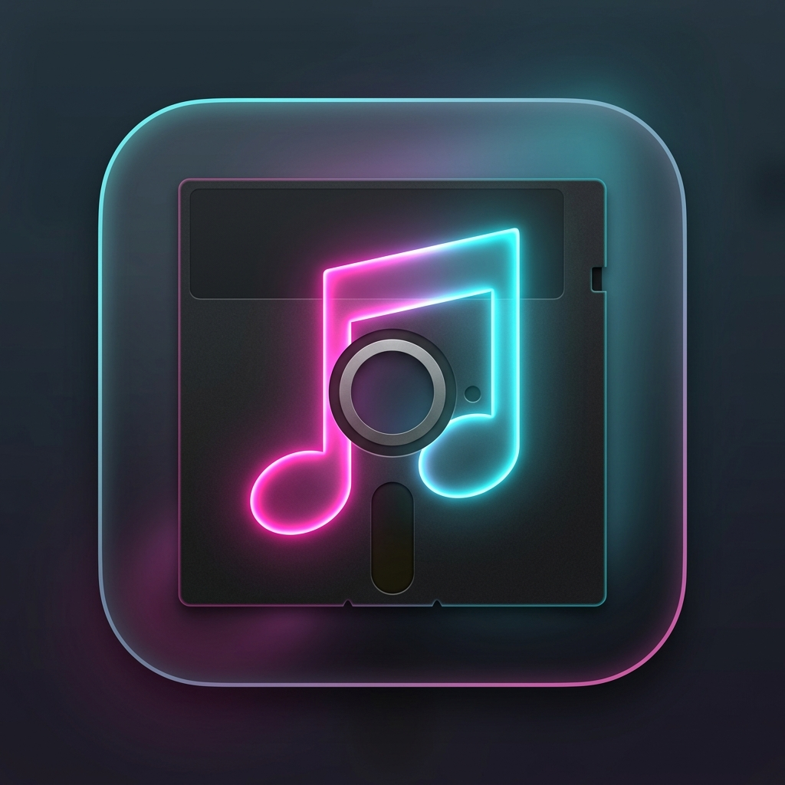
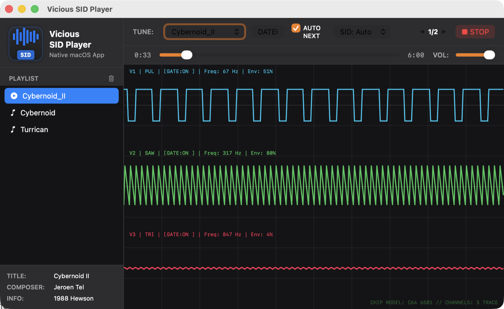

**🌐 Sprache / Language:** [English](README.md) · [Deutsch](README.de.md)

<p align="center">
  
</p>

<h1 align="center">Vicious SID Player</h1>

<p align="center">
  <strong>Commodore 64 SID chiptune player as a single-file HTML5 version and a native SwiftUI macOS app.</strong>
</p>

<p align="center">
  
</p>

A self-contained Commodore 64 SID music player in two variants:

1. **HTML5 (`vicious-sid-player.html`)** — a single HTML file (~50 KB) that runs straight from the file system via double click, no web server required.
2. **Native macOS app (`Vicious SID Player.app`)** — SwiftUI desktop application with `AVAudioEngine` and a real-time oscilloscope.

Neither variant ships any SID files. Tunes are loaded via drag & drop, file dialog, or (macOS app) by double-clicking a `.sid` file in Finder.

---

## Download

Ready-made builds of the macOS app are available as notarized DMGs on the [Releases page](https://github.com/DanielMuellerIR/vicious-sidplayer/releases). Download the DMG, open it, and drag the app into your Applications folder.

The HTML5 player needs no download beyond that: the file `vicious-sid-player.html` opens directly in the browser.

---

## Features

- **Drag & drop**: Drop single `.sid` files or entire folders onto the player. Playback starts immediately.
- **Real-time oscilloscope**: Shows the waveforms of the three SID voices (triangle, sawtooth, pulse, noise) along with frequencies, gate status, and ADSR envelopes.
- **SID model selection (macOS app)**: Picker with `Auto`, `6581`, and `8580`. `Auto` follows the preference stored in the SID file; a fixed choice forces the respective chip model and applies live to the running song (many tunes only sound right on the chip they were originally written for).
- **Quick Look preview (macOS app)**: Select a `.sid` file in Finder and press Space — the tune plays instantly, with title, composer, and copyright plus subtune switching for multi-song files. Setup: see [Quick Look preview](#quick-look-preview-for-sid-files-macos).
- **Dark / light mode**: Follows the system setting automatically or toggles manually.
- **Playlist with duplicate detection**: Already loaded tunes are not added twice. The playlist can be cleared at any time.
- **No external assets**: The entire interface (including macOS window decorations and icons) is drawn procedurally in CSS and SwiftUI Canvas.

---

## Quick Look preview for .sid files (macOS)

The app bundle includes a Quick Look extension that plays `.sid` files directly in the Finder preview. There is nothing to install separately:

1. Drag `Vicious SID Player.app` into the Applications folder (the DMG contains a shortcut).
2. Launch the app once — this registers the extension and the `.sid` file type with macOS.
3. Select a `.sid` file in Finder and press the space bar: the tune starts playing and shows title, composer, and copyright, with buttons to switch between subtunes.

If no preview appears:

- Make sure the extension is enabled: open System Settings, search for “Extensions”, and enable **Vicious SID Quick Look** under Quick Look.
- Reset the Quick Look cache in Terminal: `qlmanage -r`, then press Space on the file again.
- Test the preview directly from Terminal: `qlmanage -p /path/to/tune.sid`.

Requires macOS 13 or later.

---

## Technical background

### SID emulation

The emulator for the MOS 6581/8580 SID chip and the 6502 CPU core is based on **jsSID 0.9.1** by Hermit (Mihály Horváth, 2016, WTFPL license).

The following fixes were applied on top of the original:

- **6502 opcode mask**: `IR & 0xF0` instead of `IR & 0xC0` for implied opcodes. The faulty mask kept instructions such as `INX`, `TAY`, `PHP`, and `PLP` from executing — many songs stayed silent or froze.
- **AudioWorklet architecture**: The engine is implemented as a standalone class instead of a subclass of `AudioWorkletProcessor`, which removes the constructor error in the browser.
- **Noise waveform and ENV3 readback**: Aligned with the correct jsSID reference.
- **Swift port**: Correct 24-bit XOR shifts for combined waveforms and array guards against out-of-bounds access.

### Architecture

| Layer | HTML5 | macOS (Swift) |
|---|---|---|
| Parser | `sidplayer.js` | `SidParser.swift` |
| DSP / emulator | `sid-player-worklet.js` (AudioWorklet) | `ViciousProcessor.swift` (`AVAudioSourceNode`) |
| UI | Vanilla JS + CSS custom properties | SwiftUI + Canvas |

---

## Build

### HTML5

```bash
python3 build.py                  # → vicious-sid-player.html (~50 KB)
python3 build.py --no-min         # without minification
```

### macOS app

```bash
bash build_app.sh                 # → "Vicious SID Player.app"
```

On startup the app builds its playlist from the first of these locations that contains `.sid` files (searched recursively, including subfolders):

1. `~/Music/Vicious SID Player/` — your personal collection. Create this folder and drop `.sid` files (in any subfolder structure) there; they load automatically on launch. This lives outside the repository and is never published.
2. An `audio/` directory in the current working directory (local development via `swift run`).
3. An `audio/` directory next to the application bundle.

For release builds, `build_app.sh` automatically signs with the Developer ID
`Developer ID Application: Daniel Mueller (9QSWKSR4NQ)` if it is available in
the keychain. Local unsigned builds are possible with
`SIGN_APP=0 bash build_app.sh`.

The Quick Look extension is built as part of the app bundle
(`Contents/PlugIns/ViciousSIDQuickLook.appex`) and is therefore included in
every app build and DMG automatically.

### DMG (for releases)

```bash
bash build_dmg.sh                 # → build/Vicious SID Player.dmg
bash build_dmg.sh --notarize      # sign, notarize, and staple the DMG
```

The DMG contains a Retina-compatible background image (1x/2x TIFF via `tiffutil`).
Notarization expects a keychain profile, `SavageProtrackerNotary` by default.
It can be created once interactively:

```bash
xcrun notarytool store-credentials SavageProtrackerNotary
```

### Tests

```bash
swift test
```

---

## Publishing to GitHub

```bash
bash publish_github.sh --dry-run --release
bash publish_github.sh --release
```

The publishing script sets `origin` to
`https://github.com/DanielMuellerIR/vicious-sidplayer.git`, blocks accidentally
tracked audio and release artifacts, and with `--release` creates the matching
GitHub release entry with the DMG asset.

## Origin

The SID and CPU emulation was ported from the JavaScript project **jsSID** by Hermit and extended with the bugfixes listed above. The native macOS app is a complete reimplementation in Swift.

## License

**WTFPL** — see [LICENSE](LICENSE).
