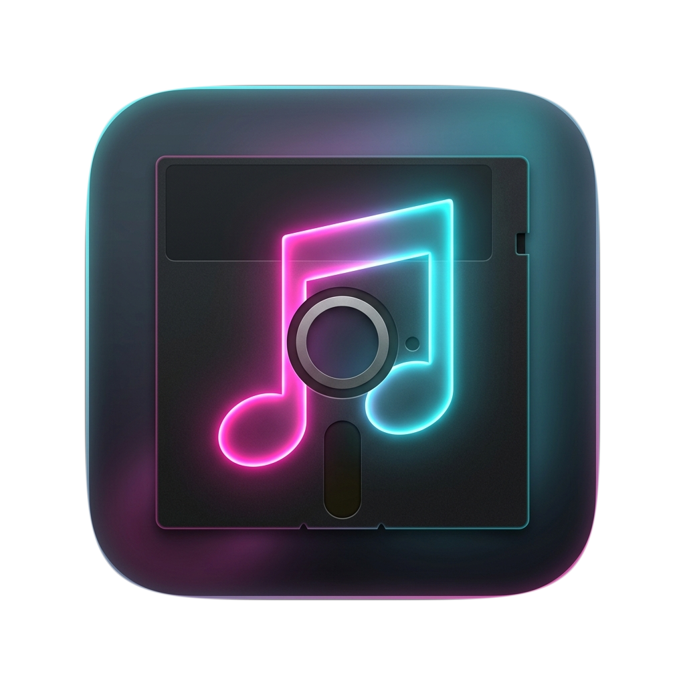
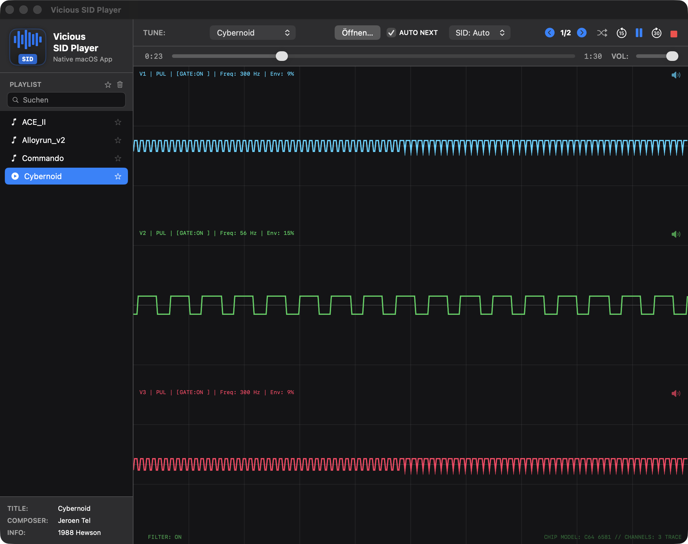
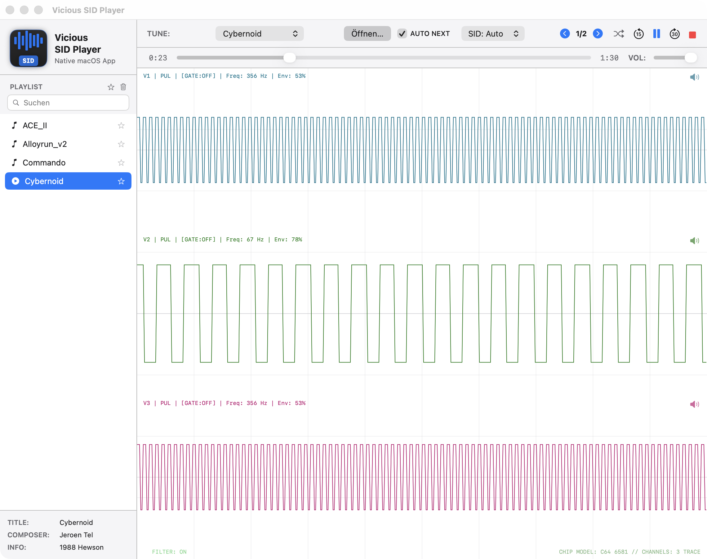

**🌐 Sprache / Language:** [English](README.md) · [Deutsch](README.de.md)

<p align="center">
  
</p>

<h1 align="center">Vicious SID Player</h1>

<p align="center">
  <strong>Commodore 64 SID chiptune player as a single-file HTML5 version and a native SwiftUI macOS app.</strong>
</p>

<p align="center">
  
  <br><br>
  
</p>

A self-contained Commodore 64 SID music player in three variants:

1. **HTML5 (`vicious-sid-player.html`)** — a single HTML file (~50 KB) that runs straight from the file system via double click, no web server required.
2. **Native macOS app (`Vicious SID Player.app`)** — SwiftUI desktop application with `AVAudioEngine` and a real-time oscilloscope.
3. **Native iOS app (`ios/`)** — SwiftUI iPhone app with background playback, lock-screen controls, and folder import. Built from source with your own developer team; see [iOS app](#ios-app-iphone).

None of the variants ship any SID files. Tunes are loaded via drag & drop, file dialog, (macOS app) by double-clicking a `.sid` file in Finder, or (iOS app) by importing a folder.

---

## Download

Ready-made builds of the macOS app are available as notarized DMGs on the [Releases page](https://github.com/DanielMuellerIR/vicious-sidplayer/releases). Download the DMG, open it, and drag the app into your Applications folder.

The HTML5 player is generated locally from the checked-in sources with
`python3 build.py`; the generated `vicious-sid-player.html` is intentionally
not tracked. It opens directly in the browser without a web server.

---

## Features

- **Drag & drop**: Drop single `.sid` files or entire folders onto the player. Playback starts immediately.
- **Real-time oscilloscope**: Shows the waveforms of the three SID voices (triangle, sawtooth, pulse, noise) along with frequencies, gate status, and ADSR envelopes.
- **SID model selection (macOS app)**: Picker with `Auto`, `6581`, and `8580`. `Auto` follows the preference stored in the SID file; a fixed choice forces the respective chip model and applies live to the running song (many tunes only sound right on the chip they were originally written for).
- **Quick Look preview (macOS app)**: Select a `.sid` file in Finder and press Space — the tune plays instantly, with title, composer, and copyright plus subtune switching for multi-song files. Setup: see [Quick Look preview](#quick-look-preview-for-sid-files-macos).
- **Real song lengths**: Reads the HVSC `Songlengths.md5` database (chosen in the settings or found automatically next to your collection) so the position slider and auto-advance use the actual tune length. Tunes without a database entry are analyzed in the background on first play (if they end in silence) and the result is cached.
- **Tune notes (STIL)**: Reads the HVSC `STIL.txt` (chosen in the settings or found automatically next to your collection) and shows what does not fit into the SID file header — which original a tune covers, who wrote the melody, notes on individual subtunes. The database belongs to the HVSC project and is not bundled.
- **Folder view**: The sidebar shows your collection either as a flat track list or as an expandable folder tree — the only workable way through an HVSC with tens of thousands of files. Toggle it in the playlist header; search and the favourites filter still show the flat list of matches.
- **Mini player**: ⌘⌥M shrinks the window to a slim bar with title, elapsed time and transport controls, for keeping it around while you work. The same shortcut brings the full window back at its previous size.
- **Remote control via URL scheme**: Drive the running app from scripts and shortcuts, with no network service:

```bash
open "vicioussid://playpause"
open "vicioussid://next"
open "vicioussid://seek?seconds=90"
open "vicioussid://subtune?index=1"
open "vicioussid://track?path=Hubbard_Rob/Commando.sid"
```

Track paths are relative to the autoplay folder. Absolute paths, `..` and anything that is not a `.sid` file are rejected — any web page can trigger a URL scheme, so playback control is all this offers.
- **2SID / 3SID stereo**: Multi-SID tunes (PSID v3/v4) play with all chips, panned in stereo, including per-chip 6581/8580 model preferences from the file header.
- **Session restore**: With shuffle off, the app resumes the last tune, subtune, and position on launch.
- **Search & favorites**: Live playlist search plus a star per track (persistent) with a favorites-only filter.
- **Voice muting & filter toggle**: Mute each of the three SID voices individually and bypass the SID filter — directly in the oscilloscope view, useful for analyzing how a tune is built.
- **WAV export**: Render the current tune to a WAV file faster than real time — from the GUI (⌘E) or headless from the command line (see [Headless / CLI](#headless--cli-for-scripts-and-ai-agents)).
- **Dark / light mode**: Follows the system setting automatically (default); a fixed light or dark appearance can be chosen in the settings (⌘,) or toggled with ⌘T.
- **Playlist with duplicate detection**: Already loaded tunes are not added twice. The playlist can be cleared at any time.
- **Shuffle**: Random playback that persists across restarts; a random song starts on launch when enabled.
- **Media keys**: Play/pause, stop, and track skipping via F7/F8/F9, the Touch Bar, and AirPods — the app registers as the system's *Now Playing* app.
- **No external assets**: The entire interface (including macOS window decorations and icons) is drawn procedurally in CSS and SwiftUI Canvas.

---

## Controls & shortcuts (macOS app)

Every control in the app has a tooltip: rest the pointer on it for a moment and a short explanation appears. macOS only shows tooltips after a delay, so they are easy to miss — here is the full reference.

**Control bar**

| Control | Function |
|---|---|
| Tune menu | Pick a track from the playlist. |
| Öffnen… | Open one or more `.sid` files. |
| Auto Next | When a tune ends, continue automatically — first through the remaining subtunes of the file, then to the next track. |
| SID: Auto / 6581 / 8580 | Chip model. `Auto` follows the file's preference; a fixed choice forces that model and applies live to the running song. |
| ‹ n / m › | Subtune navigation. A `.sid` file can hold several songs ("subtunes"); `2 / 5` means subtune 2 of 5. |
| Shuffle | Random playback. The setting persists across restarts; while on, a random song starts each time the app launches. |
| ↺ 15 | Skip 15 seconds back. |
| Play / Pause | Start playback, or pause (pausing keeps the current position and freezes the oscilloscope). |
| 30 ↻ | Skip 30 seconds forward. |
| Stop | Stop and return to the beginning. |
| Position slider | Seek — works even while paused or stopped; pressing Play then starts from that point. |
| Volume slider | Playback volume. |
| Speaker icons (oscilloscope, right edge) | Mute or unmute each SID voice individually — the emulation keeps running, only the audio contribution is removed. |
| FILTER: ON / OFF (oscilloscope, bottom left) | Bypass the SID filter; filtered voices then play unfiltered. |
| Trash (playlist header) | Clear the playlist. |

Title, composer, and info in the sidebar, as well as long track names, also show their full text as a tooltip when truncated.

**Keyboard shortcuts**

| Key | Action |
|---|---|
| Space | Play / pause |
| ⌘P | Play / pause |
| ⌘→ | Next track |
| ⌘← | Previous track |
| ⌘E | Export current tune as WAV |
| ⌘T | Toggle dark / light theme (switches to a fixed appearance; back to *Auto* via settings) |
| ⌘, | Settings (appearance, autoplay folder) |

**Media keys**

The app registers as the system's *Now Playing* app, so the media keys (F7 / F8 / F9), the Touch Bar, and AirPods controls work: play/pause, stop, and previous/next track. Title and playback position also appear in Control Center.

---

## Quick Look preview for .sid files (macOS)

The app bundle includes a Quick Look extension that plays `.sid` files directly in the Finder preview. There is nothing to install separately:

1. Drag `Vicious SID Player.app` into the Applications folder (the DMG contains a shortcut).
2. Launch the app once — this registers the extension and the `.sid` file type with macOS.
3. Select a `.sid` file in Finder and press the space bar: the tune starts playing and shows title, composer, and copyright, with buttons to switch between subtunes.

If no preview appears:

- Make sure the extension is enabled: open System Settings, search for “Extensions”, and enable **Vicious SID Quick Look** under Quick Look.
- Reset the Quick Look cache in Terminal: `qlmanage -r`, then press Space on the file again.
- Test the preview directly from Terminal: `qlmanage -p /path/to/tune.sid`.

Requires macOS 13 or later.

---

## iOS app (iPhone)

A native SwiftUI iPhone app lives in `ios/`. It shares the entire emulation core
with the macOS app — same parser, same 6502/SID emulation, same song-length
resolution.

There is no App Store build. You build and sideload it yourself with your own
Apple Developer team; the project deliberately avoids private APIs and ships a
privacy manifest, so the App Store route stays open.

**What it does**

- **Background playback**: music keeps running when the screen is locked, with
  play/pause, previous/next and position control from the lock screen, the
  Control Center and AirPods.
- **Folder import**: pick a folder (iCloud Drive, Nextcloud, “On My iPhone”) and
  the app walks it recursively, keeping the directory structure, skipping
  duplicates, with progress and a cancel button.
- **Finder file sharing**: connect the iPhone by cable, open Finder → Files, and
  drag whole folders straight into the app. The library also shows up in the iOS
  Files app under “On My iPhone”. Files added or deleted from outside are picked
  up automatically.
- **Reset library**: throw everything away and refill it — favorites optionally
  kept.
- Oscilloscope, subtunes, voice muting, filter bypass, SID model selection,
  song lengths, search, favorites, shuffle, session restore, theme and WAV
  export, as on the desktop.

The oscilloscope and all UI timers only run while the app is in the foreground.
In the background the audio keeps playing and the drawing stops — that is the
single biggest battery saver here.

**Build**

Requires Xcode 16 or later (the project uses `objectVersion 77` with file-system
synchronized groups, so new Swift files are picked up without editing the
project file) and iOS 17 or later on the device.

```bash
# Simulator — no signing, no developer account needed
bash ios/scripts/build-simulator.sh
bash ios/scripts/run-tests.sh

# Real device — needs your Apple Developer team ID
cp ios/env.example ios/.env      # then fill in DEVELOPMENT_TEAM
bash ios/scripts/apply-env.sh
bash ios/scripts/build-device.sh
```

`ios/.env` and the generated `ios/Config/Local.xcconfig` are both git-ignored,
but they are not the only source: the project file carries a committed
`DEVELOPMENT_TEAM` and bundle ID so that a device build also works straight from
the Xcode GUI. `build-device.sh` passes the values from `ios/.env` to
`xcodebuild`, which overrides the project file; in the Xcode GUI you have to
change them in the project file itself. Details are in
`ios/Config/Signing.xcconfig`.

Background playback and lock-screen control **cannot be verified in the
simulator** — it has no real lock screen, no AirPods and no incoming calls. The
manual checklist for a real device is in `ios/GERAETETEST.md` (German).

---

## Headless / CLI (for scripts and AI agents)

The emulation core runs without the GUI. The `sidcheck` tool exposes it for shell scripts, CI pipelines, and AI agents — machine-readable output, script-friendly exit codes (`0` = success, `1` = error in `--dump`/`--wav`, `2` = usage):

```bash
swift build -c release          # builds .build/release/sidcheck

# Render a tune to WAV faster than real time (16-bit PCM mono, 44.1 kHz)
.build/release/sidcheck tune.sid --wav out.wav 180 0     # 180 seconds, subtune 0

# Dump the SID register state (frequency, gate, waveform, envelope per voice)
# as JSON, one frame every 20 ms — e.g. for note or sound-parameter analysis
.build/release/sidcheck tune.sid --dump analysis.json 15

# Crash sweep: briefly play all subtunes; the process only dies on emulator traps
.build/release/sidcheck tune.sid
```

---

## Linux (CLI player)

The emulation core is platform-neutral, so the player also runs on Linux — as a command-line player named `vicious-sid`. There is no native Linux GUI; the HTML5 player covers that need.

**Requirements:** Swift 6.0 plus `libasound2-dev` and `libdbus-1-dev` to build; `libasound2` and `libdbus-1-3` are needed at runtime. The binary uses ALSA for audio and D-Bus for MPRIS2 media controls.

```bash
sudo apt install libasound2-dev libdbus-1-dev

swift build     # no special flags needed: the Apple-only targets (app, Quick Look)
swift test      # are left out of the package on Linux
```

Usage:

```bash
vicious-sid tune.sid                    # real-time playback via ALSA
vicious-sid tune.sid --subtune 2        # pick a subtune (0-based)
vicious-sid tune.sid --seconds 30       # stop after 30 seconds
vicious-sid tune.sid --wav out.wav      # render faster than real time

# Raw PCM into a pipe (s16le, interleaved)
vicious-sid tune.sid --stdout | aplay -f S16_LE -r 44100 -c 2
```

While a tune is playing at a terminal, single keys control it: **space** pauses and resumes, **n** and **p** step through subtunes, **q** or **Ctrl-C** quits. When stdin is not a terminal — in a script or a CI job — the keyboard handling is skipped and the player simply plays.

The player also registers with **MPRIS2** on the session bus, so media keys and the desktop's sound applet can control it like any other player. If there is no session bus — over SSH, or in a container — playback simply continues without it.

Playback goes through ALSA and therefore works with PipeWire and PulseAudio too. Everything human-readable — title, author, errors — goes to stderr, so stdout stays a clean audio stream. Exit codes: `0` = success, `1` = argument or parser error, `2` = I/O error.

### Packaging

`build_deb.sh` produces a `.deb` with the statically linked binary, the desktop entry for the `audio/prs.sid` file association, and the icon:

```bash
./build_deb.sh
sudo apt install ./vicious-sid_<version>_amd64.deb
```

Because the Swift runtime is linked in statically, the package only depends on `libasound2` and `libdbus-1-3` — no Swift toolchain is needed on the target machine.

The WAV output is byte-identical between the macOS (arm64) and Linux (x86_64) builds — the emulation computes the same samples on both, and a test pins this down. Verified on Linux Mint 22.2 (Ubuntu 24.04 base), x86_64, Swift 6.0.3.

---

## Technical background

### SID emulation

The emulator for the MOS 6581/8580 SID chip and the 6502 CPU core is based on **jsSID 0.9.1** by Hermit (Mihály Horváth, 2016, WTFPL license).

The following fixes were applied on top of the original:

- **6502 opcode mask**: `IR & 0xF0` instead of `IR & 0xC0` for implied opcodes. The faulty mask kept instructions such as `INX`, `TAY`, `PHP`, and `PLP` from executing — many songs stayed silent or froze.
- **AudioWorklet architecture**: The engine is implemented as a standalone class instead of a subclass of `AudioWorkletProcessor`, which removes the constructor error in the browser.
- **Noise waveform and ENV3 readback**: Aligned with the correct jsSID reference.
- **Swift port**: Correct 24-bit XOR shifts for combined waveforms and array guards against out-of-bounds access.

### Architecture

| Layer | HTML5 | macOS (Swift) |
|---|---|---|
| Parser | `sidplayer.js` | `SidParser.swift` |
| DSP / emulator | `sid-player-worklet.js` (AudioWorklet) | `ViciousProcessor.swift` (`AVAudioSourceNode`) |
| UI | Vanilla JS + CSS custom properties | SwiftUI + Canvas |

---

## Build

### HTML5

```bash
python3 build.py                  # → vicious-sid-player.html (~50 KB)
python3 build.py --no-min         # without minification
```

### macOS app

```bash
bash build_app.sh                 # → "Vicious SID Player.app"
```

On startup the app builds its playlist from an autoplay folder, searched recursively (subfolders included). Pick any folder in the app settings (app menu → "Settings…", Cmd+,); without a custom choice the default is `~/Music/Vicious SID Player/`. Drop your `.sid` files there; they load automatically on launch. Changing the folder in the settings reloads the playlist immediately. The folder lives outside the repository and is never published.

For release builds, `build_app.sh` automatically signs with the Developer ID
`Developer ID Application: Daniel Mueller (9QSWKSR4NQ)` if it is available in
the keychain. Local unsigned builds are possible with
`SIGN_APP=0 bash build_app.sh`.

The Quick Look extension is built as part of the app bundle
(`Contents/PlugIns/ViciousSIDQuickLook.appex`) and is therefore included in
every app build and DMG automatically.

### Install and release

Three entry points, deliberately separated:

```bash
bash build_app.sh                 # build only, stays in the project directory
./install.sh                      # build, notarize, install into /Applications
./release.sh                      # build, notarize, package the DMG — never installs
```

`install.sh` and `release.sh` both notarize the **app itself** and staple its
ticket before anything else happens. That matters: an app that only travels
inside a notarized disk image loses its guarantee the moment someone drags it
out. `release.sh` then notarizes and staples the disk image as well.

The DMG contains a Retina-compatible background image (1x/2x TIFF via
`tiffutil`). For finer control, `build_dmg.sh` can still be called directly:

```bash
bash build_dmg.sh                 # → build/Vicious SID Player.dmg
bash build_dmg.sh --notarize      # sign, notarize, and staple the DMG
```

Notarization needs a notarytool keychain profile. Keychain profiles are local to
each Mac and are never synchronized, so the name is taken from `NOTARY_PROFILE`
or from this clone's own configuration:

```bash
git config --local viciousSidPlayer.notaryProfile <profile>
xcrun notarytool store-credentials <profile> --apple-id <apple-id> --team-id <team-id>
```

### Tests

Two suites, and one does not replace the other:

```bash
# Platform-neutral core: parser, 6502/SID emulation, song lengths, library logic
swift test

# iOS glue layer in the simulator: app model, Info.plist contract, privacy manifest
bash ios/scripts/run-tests.sh
```

---

## Publishing to GitHub

```bash
bash publish_github.sh --dry-run --release
bash publish_github.sh --release
```

The publishing script sets `origin` to
`https://github.com/DanielMuellerIR/vicious-sidplayer.git`, blocks accidentally
tracked audio and release artifacts, and with `--release` creates the matching
GitHub release entry with the DMG asset.

## Origin

The SID and CPU emulation was ported from the JavaScript project **jsSID** by Hermit and extended with the bugfixes listed above. The native macOS app is a complete reimplementation in Swift.

## License

**WTFPL** — see [LICENSE](LICENSE).
